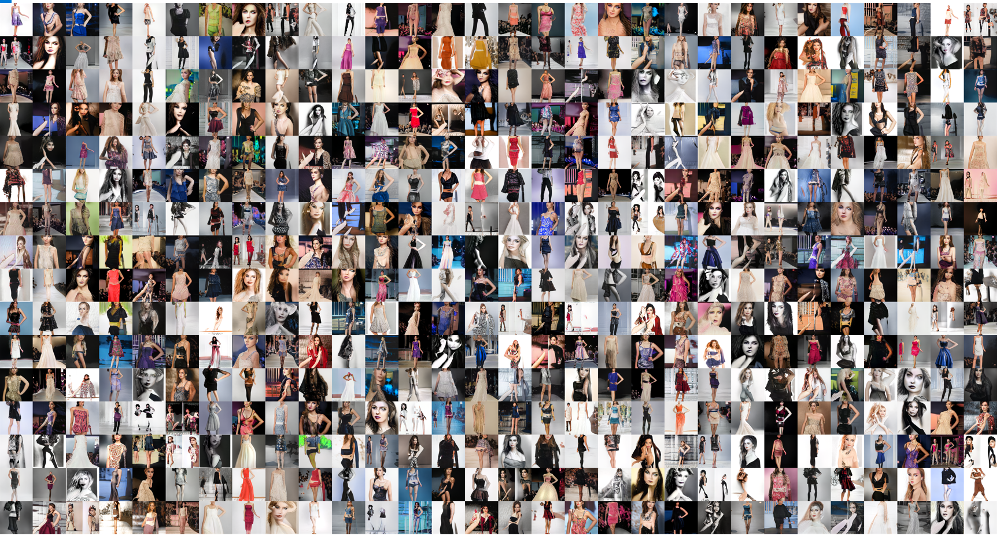

# FashionGAN
Train StyleGAN 2 ADA on Fashion images and generate images with it. This jupyter notebook only includes generating images using the pre-trained model and training part will be addad later. The model used in this repository is the checkpoint of 3200 kimgs so the results are not great yet. 

## Dataset for training 
For gathering training images [pyimgdata](https://github.com/jeffheaton/pyimgdata), an open source project was used.

## References 
- [Training a GAN from your own images: StyleGAN2 ADA](https://www.youtube.com/watch?v=kbDd5lW6rkM&t=2s)
- [StyleGAN2 ADA tutorial](https://github.com/jeffheaton/t81_558_deep_learning/blob/master/t81_558_class_07_3_style_gan.ipynb)
